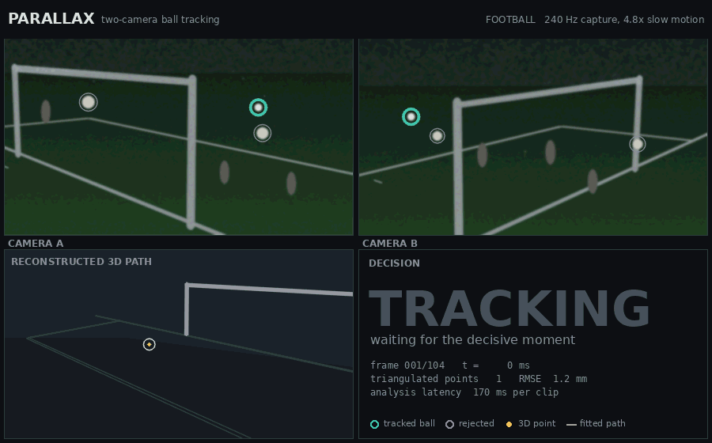
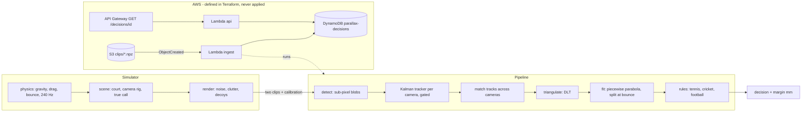
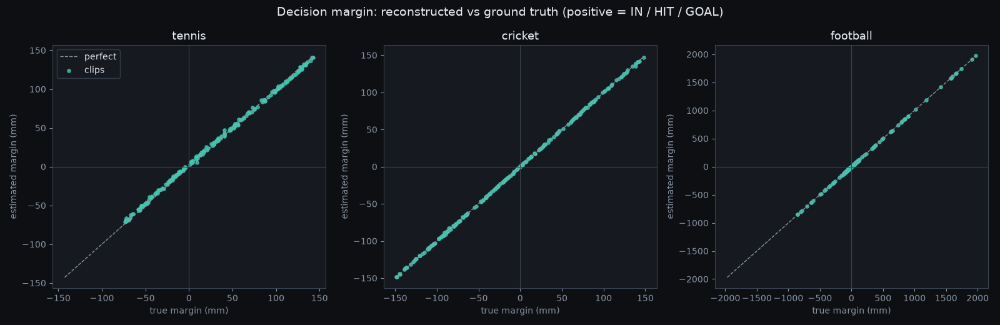

# parallax-ball-tracker

Two synchronised cameras, one ball: detect, track, triangulate to 3D, fit the flight and make the line call (tennis IN/OUT, cricket LBW HIT/MISS, football GOAL/NO_GOAL), plus an AWS deployment defined in Terraform.

[](https://github.com/armaghanrashid/parallax-ball-tracker/actions/workflows/ci.yml)



Per-sport demos: [tennis](docs/media/tennis.gif), [cricket](docs/media/cricket.gif), [football](docs/media/football.gif).

## Why it's interesting

- **Millimetre-level 3D from commodity pixels.** Sub-pixel blob centroids from two calibrated cameras, triangulated with a depth-weighted DLT, give about 1.3 mm RMS error per point on simulated footage with sensor noise, moving clutter and decoy balls.
- **The call is a physics problem, not a classifier.** The path is fitted as a piecewise parabola split at the bounce, so a tennis ball's contact point, a cricket ball's projected line to the stumps and a football's crossing point are all read from a model, with a signed margin in millimetres.
- **Honest evaluation.** Every number below comes from simulated clips scored against exact ground truth (the same rules applied to the true path), including a separate score for close calls under 10 mm. The pipeline imports no AWS code; the Lambda handler is a thin shell around it.

## Architecture



| Module | Role |
|:--|:--|
| `parallax/sim/{physics,scene,render}.py` | 240 Hz flight with drag and bounce, court and camera rigs, noisy footage with moving clutter |
| `parallax/vision/{detect,track,triangulate,fit}.py` | blob detection, constant-acceleration Kalman tracking with gating, DLT, robust piecewise-parabola fit |
| `parallax/rules/{tennis,cricket,football}.py` | the calls, from a fitted (or exact) trajectory |
| `parallax/pipeline.py`, `eval.py`, `cli.py`, `viz.py` | end-to-end analysis, benchmark, command line, GIF rendering |
| `cloud/lambda_handler.py`, `infra/terraform/` | S3 to DynamoDB handler, HTTP read API, infrastructure |

### AWS deployment (defined, never applied)

`infra/terraform` describes a private, encrypted, versioned S3 bucket; a container-image Lambda (ECR) triggered by `s3:ObjectCreated` on `clips/*.npz`; an on-demand DynamoDB table; and an HTTP API route `GET /decisions/{id}` served by a second function from the same image with a read-only role. IAM is least-privilege (ingest: `s3:GetObject` on `clips/*` and `dynamodb:PutItem`; API: `dynamodb:GetItem`). There are no account IDs; state is local.

To deploy it you would: `terraform apply -target=aws_ecr_repository.pipeline -var bucket_name=<unique-name>`, build and push the image (`docker build -f cloud/Dockerfile .`, tag it with the repository URL from the output), then run a full `terraform apply`. Upload a clip made by `python -m parallax.cli clip` to `clips/` and read the result at `<api_url>/decisions/<clip-name>`. None of this has been run; CI only checks `terraform fmt` and `terraform validate`, and the Lambda code is exercised end to end against `moto` S3 and DynamoDB.

## Quickstart

Requires Python 3.12 and `ffmpeg` (only for GIF output).

```bash
python3.12 -m venv .venv
source .venv/bin/activate
pip install -r requirements.txt

pytest -q
python -m parallax.eval --n 200
python -m parallax.cli demo --sport tennis   --out docs/media/tennis.gif
python -m parallax.cli demo --sport cricket  --out docs/media/cricket.gif
python -m parallax.cli demo --sport football --out docs/media/football.gif

# a clip in the format the Lambda handler reads, and the decision from it
python -m parallax.cli clip --sport cricket --out clip.npz
python -m parallax.cli analyze clip.npz
```

A clip (`.npz`) holds `frames` (2, N, H, W, 3), the calibration `K`, `R`, `t` for both cameras, `sport` and `fps`. The 63-frame demo clip is about 50 MB compressed.

## Results

Produced by `python -m parallax.eval --n 200` (200 simulated clips per sport, seeds 0 to 199, one process on an Apple-silicon laptop):

| Sport | Clips | Decided (%) | 3D RMSE, triangulated (mm) | 3D RMSE, fitted (mm) | Call accuracy (%) | Close calls (n) | Close-call accuracy (%) | Mean latency (ms) |
|:--|--:|--:|--:|--:|--:|--:|--:|--:|
| tennis | 200 | 99.0 | 1.46 | 0.53 | 99.0 | 20 | 100.0 | 90.8 |
| cricket | 200 | 100.0 | 1.28 | 0.43 | 100.0 | 17 | 100.0 | 97.6 |
| football | 200 | 100.0 | 1.14 | 0.52 | 100.0 | 6 | 100.0 | 129.1 |

- *3D RMSE, triangulated*: error of each per-frame 3D point against the true ball centre. *Fitted*: error of the fitted trajectory over the frames it was built from.
- *Close call*: the true margin to the line, stumps or frame is under 10 mm. Latency covers detect, track, triangulate, fit and rule for a whole clip (about 60 to 100 frames per camera), excluding rendering.
- Tennis bounces land within 110 mm of the baseline edge, cricket paths are steered to within 300 mm of the middle stump, and football shots aim at the posts, the bar or open goal, so a large share of clips are genuine close calls. The two undecided tennis clips (seeds 29 and 60) lost the ball track at the bounce (in seed 29 a same-sized decoy sat beside the ball), so no bounce was observed; the pipeline returns no call rather than guessing.



**Caveats.** All footage is simulated, camera calibration is exact, and ball detection benefits from a bright ball on a dark scene. These numbers show the geometry, tracking and fitting are sound; they are not a claim about real stadium footage, where calibration error and lighting would dominate.

## Testing

```bash
pytest -q        # 147 tests, about 20 s
ruff check . && ruff format --check .
```

- Triangulation recovers known points to under 1 mm without noise, and to millimetres with 0.1 px noise.
- The Kalman tracker follows a synthetic path through a bounce, rejects stationary, drifting, fast-glint and look-alike decoys, coasts through missed detections and picks up a ball that appears mid-clip.
- Each rule is checked on hand-built edge cases: a ball touching the line counts as IN, a ball clipping the bails is HIT while one above them is MISS, and a ball must be wholly inside the posts and under the bar for a goal.
- The Lambda handler runs end to end against `moto` S3 and DynamoDB; the Terraform is checked statically (every reference declared, private bucket, on-demand table, no wildcard IAM actions).
- CI runs lint and tests, and `terraform fmt -check`, `init -backend=false` and `validate` without credentials.

## Design decisions and trade-offs

- **Simulation first.** There is no public dataset with two calibrated high-speed views and millimetre ground truth, so the simulator generates exact truth and the tests and benchmark are reproducible from a seed. The cost is realism: see the caveats above.
- **Classical vision, no learned detector.** A thresholded, shape-filtered blob with a bright-core refinement is accurate to about 0.1 px and explainable. The refinement splits a ball that touches a dimmer decoy; it fails if the decoy is brighter than the ball.
- **Tracker proposes, geometry decides.** Each camera keeps several gated Kalman tracks. Speed alone cannot pick the ball (a ball flying along the optical axis barely moves in the image), so the pipeline picks the pair of tracks, one per camera, that triangulate consistently with a plausible height and real motion.
- **Piecewise parabola with one split.** Drag makes real arcs slightly non-parabolic, but over a tenth of a second the error is well under a millimetre and extrapolating a cricket path to the stumps stays accurate. Robust (soft-L1) fitting plus one pruning pass absorbs the odd bad triangulation. The model cannot represent a second bounce or a post deflection.
- **Rules are separate from the model.** The same rule code scores the fitted path and the exact path, so ground truth and prediction can only differ through reconstruction error.
- **Rule simplifications.** Tennis uses a 20 mm ball footprint; cricket models only the "would it have hit the stumps" projection, not pitching or impact conditions; football judges the instant the trailing edge of the ball crosses the line.
- **One image, two functions.** The ingest and API Lambdas share a container image with different handlers, which keeps one build while giving each its own role.

## Licence

Copyright (c) 2026 Muhammad Armaghan Rashid. All rights reserved. Source published for viewing only; see [LICENSE](LICENSE).
